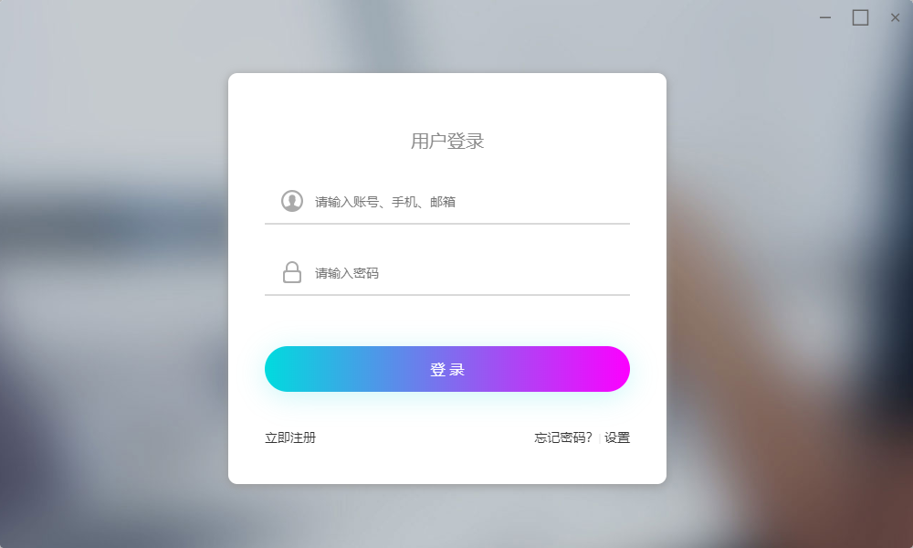
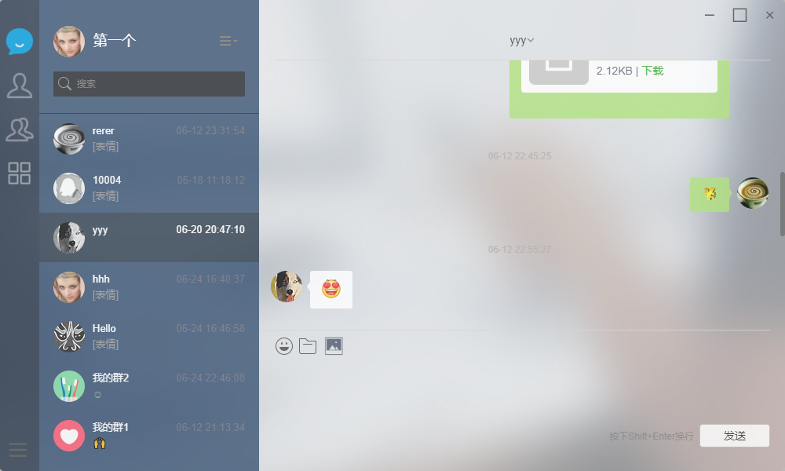
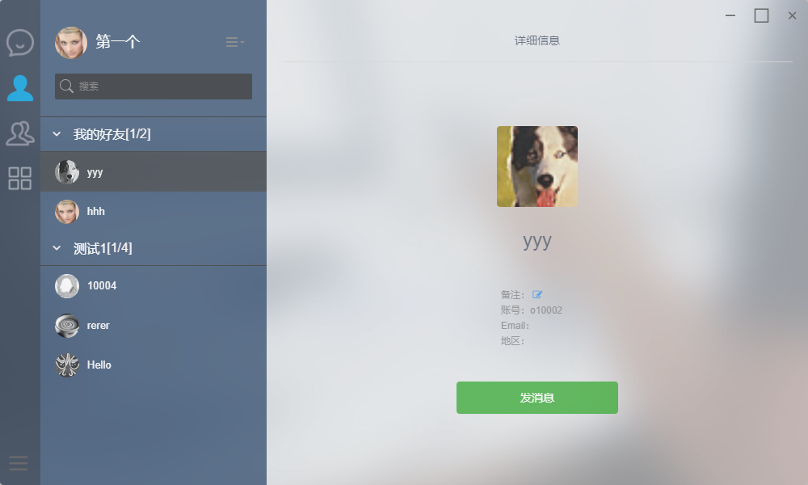
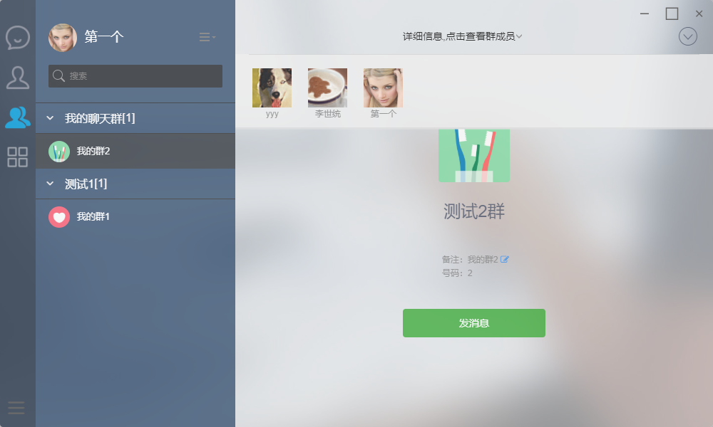
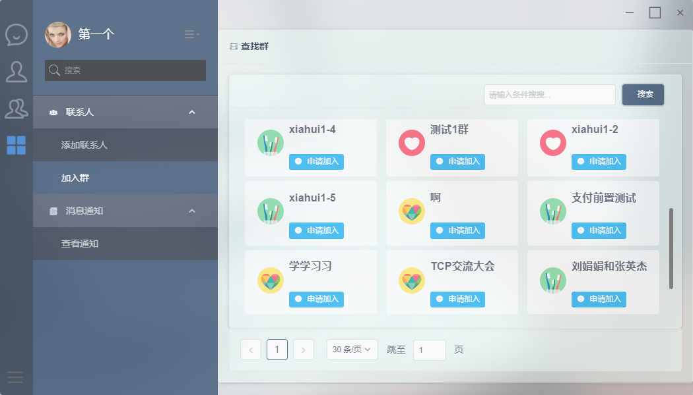

<p align="center">
    
</p>

<h1 align="center">OIM-E</h1>

# 简介
OIM-E是基于Electron实现的PC桌面聊天软件，可支持Windows、Linux、Mac等主流平台。
主要采用了Vue、iView、TypeScript等技术实现，通讯协议主要是websocket。服务端支持私有部署，可用于企业内部管理通讯等功能。项目可用于任何商业、个人作品中并且希望能够保留作者信息。如果OIM能够帮助到您，请点赞好评，加个星。

## 主要功能
* 个人资料<br>
  资料修改<br>
  自定义头像
* 联系人<br>
    联系人分组<br>
    联系人备注名<br>
    联系人管理<br>
* 群<br>
    群分组<br>
    群管理<br>
* 聊天<br>
    私聊<br>
    群聊<br>
    支持 图片、表情、文件、图文混排

    
## 截图







## 关于服务端
整个完整项目是包含服务端的，所以本项目是需要的服务端支持。服务端是采用Java开发，同样都是开源的。
服务端源码地址：https://gitee.com/oimchat/oim-server 分支 1.0.0 

## 命令

```
初次下载源码后进行安装依赖
npm install

开发调试
npm run dev

打包构建（分别在不同平台打不同的包）
npm run electron:build
```
